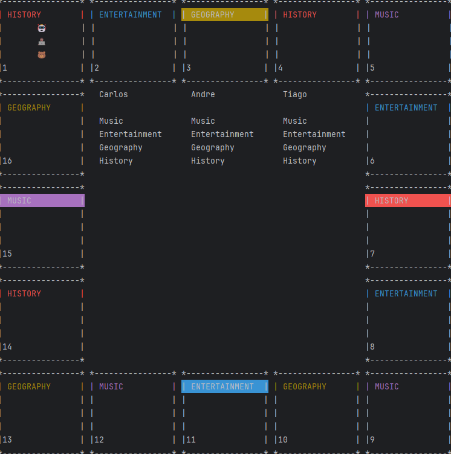

            ████████╗██████╗ ██╗██╗   ██╗██╗ █████╗ ██╗          
            ╚══██╔══╝██╔══██╗██║██║   ██║██║██╔══██╗██║          
               ██║   ██████╔╝██║██║   ██║██║███████║██║          
               ██║   ██╔══██╗██║╚██╗ ██╔╝██║██╔══██║██║         
               ██║   ██║  ██║██║ ╚████╔╝ ██║██║  ██║███████╗     
               ╚═╝   ╚═╝  ╚═╝╚═╝  ╚═══╝  ╚═╝╚═╝  ╚═╝╚══════╝     
                                                                 
            ██████╗ ██╗   ██╗██████╗ ███████╗██╗   ██╗██╗████████╗
            ██╔══██╗██║   ██║██╔══██╗██╔════╝██║   ██║██║╚══██╔══╝
            ██████╔╝██║   ██║██████╔╝███████╗██║   ██║██║   ██║  
            ██╔═══╝ ██║   ██║██╔══██╗╚════██║██║   ██║██║   ██║  
            ██║     ╚██████╔╝██║  ██║███████║╚██████╔╝██║   ██║  
            ╚═╝      ╚═════╝ ╚═╝  ╚═╝╚══════╝ ╚═════╝ ╚═╝   ╚═╝  
                                                                 



Trivial Pursuit is a MindSwap game created by André Nunes, Carlos Silva, Hélder Ribeiro and Tiago Moreira. This was our first group project.
The game is inspired by the popular board game of the same name. In our version, three players compete against each other to find out who is more eclectic.

How to start:
```
Compile and run ServerLauncher;
Compile and run ClientLauncher, as many times as you want. 
Each time you create a new Player in the server;
Enjoy!
```

How to play:
```
The game requires 3 players;
One player can create a lobby and the others can join;
Once the lobby is full, any player can start the game;
Use the /roll and /answer commands accordingly;
```